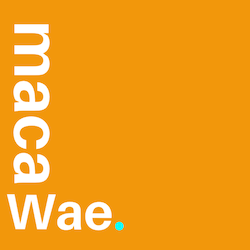
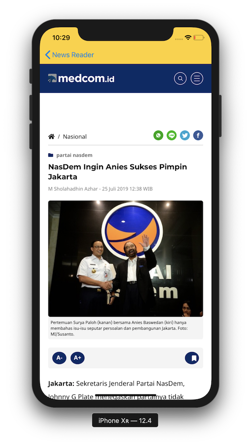
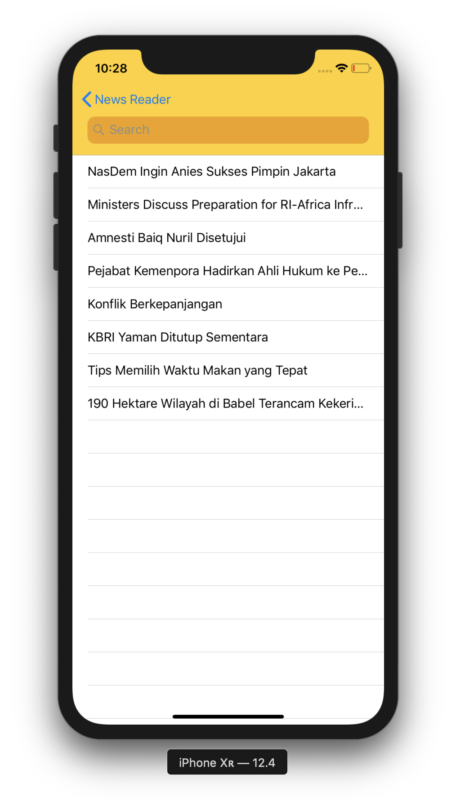
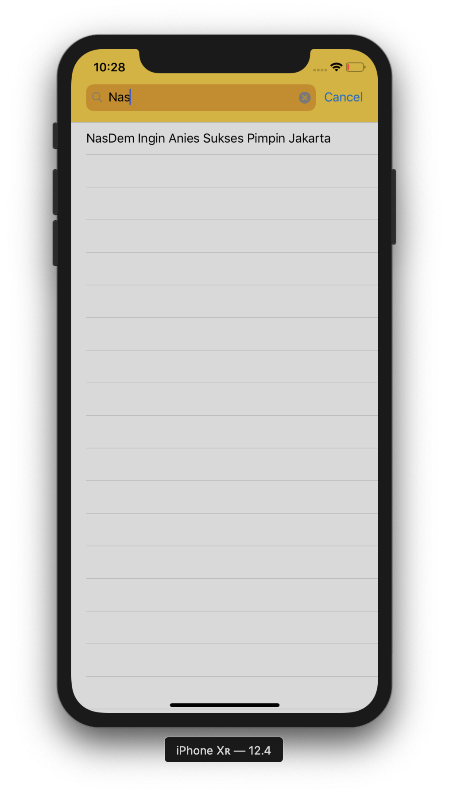
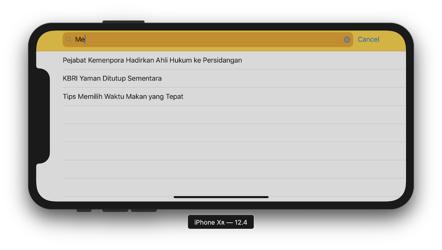
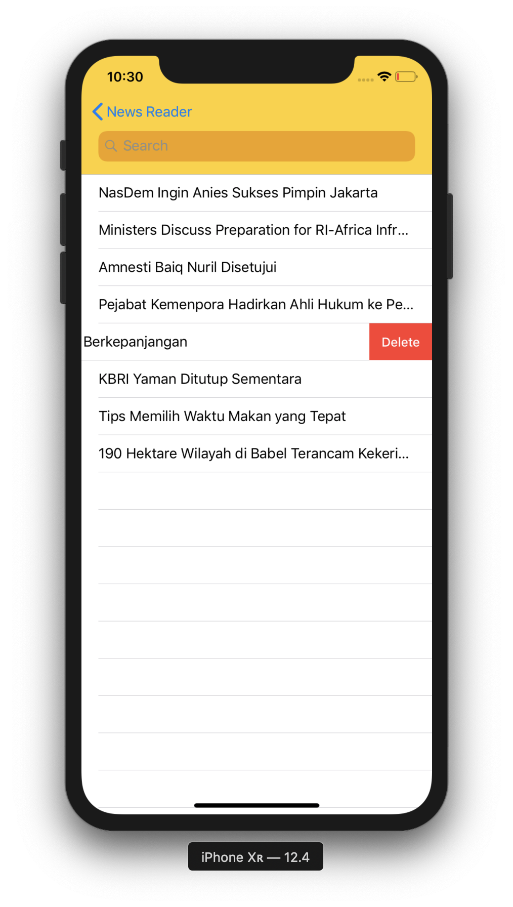

<p align="center">
    
</p>
<center> 
    <h1>Getting Update Gets Easy</h1>
</center>

## The Goal 📰
Building a simple news reader app

---

## Features 📰
* Reading News ✅
<p align="center">
    
</p>

* Save the article to be read later ❎ (on progress)
<p align="center">
    
</p>

* Filter the news based on the title ✅
<p align="center">
    
</p>

* Swipe to remove saved article ✅
<p align="center">
    
    
</p>

* Available on all iPhone ✅

---

## Requirement 📰
To run this project, just open:
```
20_NewsReader.xcworkspace
```

---
Odji Chrissy 📩[satyananda.chrissy@gmail.com](mailto:satyananda.chrissy@gmail.com)

[Linkedin](www.linkedin.com/in/chrissysatyananda) | [Github](https://github.com/odjichrissy)